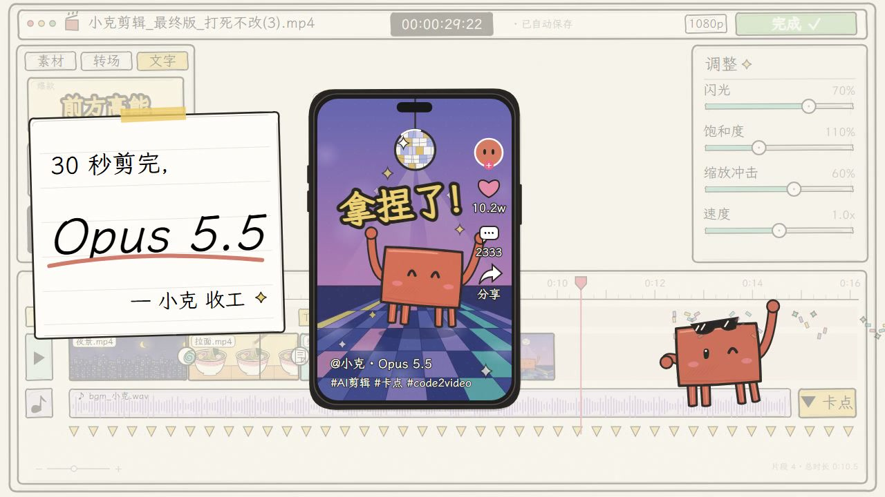

# Claude 剪视频过程 · Remotion 复刻

30 秒手绘风剪辑界面动画，1280 × 720，30 fps，共 900 帧。使用 React、Remotion 和原创 SVG 重建界面与角色，所有动作由帧号驱动。字体、插画与原创合成音轨均随工程提供，渲染无需访问参考视频。

本版本参考了 [Wise Wong 的同片段工程](https://github.com/WiseWong6/claude-video-editing-remotion)，补充可直接双击播放的离线预览、完整播放控件与组件分层；同时调整缩略图构图、四条腿的角色、导出星形眼睛、片尾墨镜与收工便签。

参考片段：[MotionFace · e3ee409a-50f7-4b4a-af27-288226e47a57](https://motionface.cc/?recording=e3ee409a-50f7-4b4a-af27-288226e47a57)。标题 “claude_剪视频过程motion” 仅作为参考标识。



## 离线播放

使用 Node.js 22 或更高版本、pnpm 11.25.0：

```sh
pnpm install --frozen-lockfile
pnpm run build
```

双击 `dist/index.html` 即可播放，字体与程序已内嵌，无需启动服务器或保持联网。分享时请保留整个 `dist` 文件夹，音频和许可说明在相邻文件中。

播放条提供播放／暂停、拖动进度、重播、0.5／1／1.5／2／3 倍速和声音开关；空格切换播放。初始静音，系统启用「减少动态效果」时初始暂停；切到后台会暂停，返回后恢复之前的播放状态。时间显示保持成片位置，便于定位镜头。

## 编辑与渲染

编辑逐帧动画时运行 `pnpm run studio`，在 Studio 中选择 `ClaudeEditingMotion`。

```sh
pnpm run check
pnpm run render
pnpm run verify
pnpm run still
```

成片保存到 `renders/claude-editing-motion.mp4`；封面为 `renders/poster.png`。`verify` 检查尺寸、帧率、900 帧、音频流、完整解码和音频峰值，并输出 `renders/verification.json`。第一次渲染时 Remotion 可能下载 Chrome Headless Shell；后续使用本地缓存。Remotion Studio 默认在终端显示本地地址。

可选的单帧预览：

```sh
pnpm exec remotion still src/index.tsx ClaudeEditingMotion renders/frame-12s.png --frame=360
```

重建配乐与音效：

```sh
pnpm run audio
```

## 可修改的内容

| 文件 | 内容 |
| --- | --- |
| `src/video-config.ts`、`src/Root.tsx` | 画幅、时长、帧率和 Composition ID |
| `src/Composition.tsx` | 代码窗开场、全局镜头、成片手机、片尾便签 |
| `src/Editor.tsx` | 素材库、时间线、波形、拖拽、撤销、滑杆、导出 |
| `src/Artwork.tsx` | 城市、拉面、柴犬、舞厅和小克的原创 SVG |
| `src/components/Drawing.tsx`、`src/palette.ts` | 可复用手绘边框、气泡、星星、手臂与配色 |
| `src/timing.ts` | 秒级动作锚点、镜头路径、预览切片 |
| `src/Preview.tsx`、`src/preview.css` | 离线播放界面与响应式播放控制 |
| `tools/build-preview.mjs` | 生成可直接打开的离线 HTML 与相邻音频 |
| `tools/make-audio.mjs` | 原创旋律、节拍和操作音效，可调整事件时间 |

动画依次还原代码窗展开、四段素材入轨、清除灰色冗余片、旋转/翻页/glitch、文字模板、Ctrl+Z、调色滑杆、波形卡点、导出进度停留与完成、短视频手机和 `Opus 5.5` 便签。暖纸色、深色手绘轮廓、薄荷绿、芥末黄与紫蓝舞池保持参考的视觉方向。

这是可编辑的组件复刻；插画、字体细节和微动作并非逐像素一致。配乐为独立创作的确定性电子木琴/拨弦节拍与音效，与参考原曲不同。公开工程不含参考 MP4、参考截图、参考音轨、签名下载地址或网站绑定凭证。

## 字体与依赖

随工程附带的 [LXGW WenKai Lite](https://github.com/lxgw/LxgwWenKai) 使用 SIL Open Font License 1.1，许可全文在 `public/fonts/OFL.txt`。完整 TTF 保留原名与版权信息；当前动画使用其字形子集 `MotionHand-Regular.woff2`，子集内部名称已改为 Motion Hand，并保留原版权信息。若新增子集外汉字，可以扩充子集，或在 `src/Composition.tsx` 中改用随附的完整 TTF；离线预览的字体导入位于 `src/Preview.tsx`。

预览控件、响应式样式与构建方法参考 Wise Wong 的 MIT 代码，原始版权与完整许可见 `THIRD_PARTY_NOTICES.md`。该参考仓库的原片音轨未纳入此工程，音频仍由 `tools/make-audio.mjs` 生成。

Remotion 使用其上游许可，具体见 [Remotion 许可说明](https://www.remotion.dev/docs/license)。React 与其他依赖许可见对应软件包。

制作依据：[Remotion 按帧动画](https://www.remotion.dev/docs/animating-properties)、[渲染命令](https://www.remotion.dev/docs/cli/render)。
